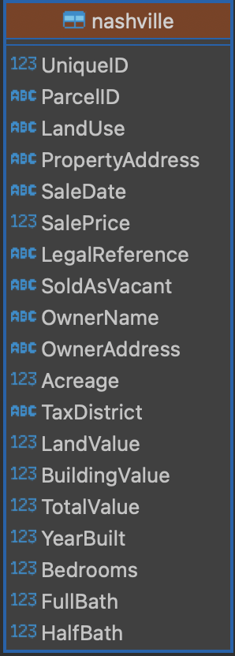
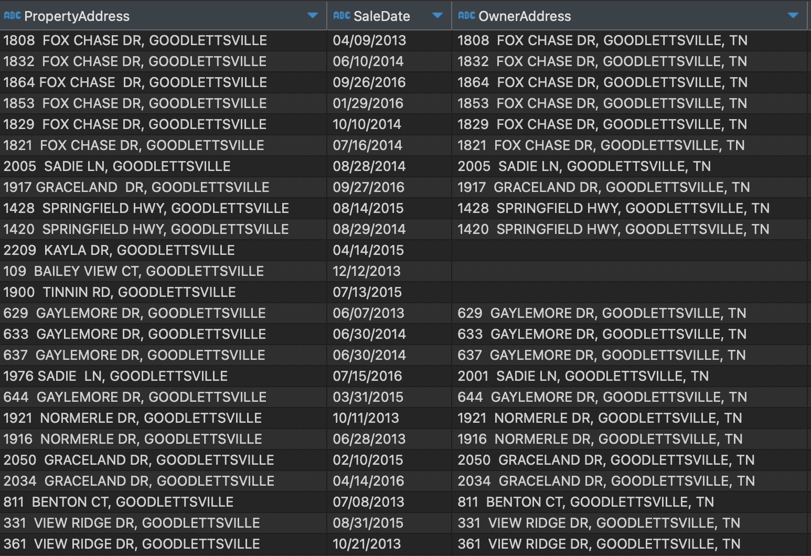
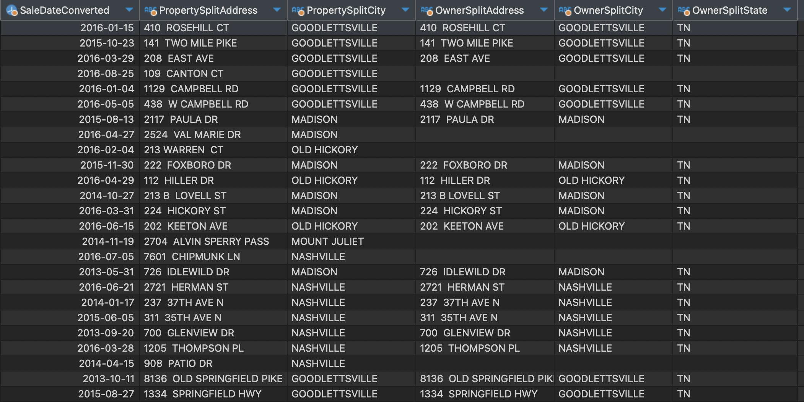

# Nashville Housing Data Cleaning in SQL

This project focuses on cleaning raw housing transaction data from Nashville (2013–2016) using SQL. The goal was to prepare the dataset for analysis by fixing data types, handling missing values, splitting compound fields, standardizing inconsistent values, and removing duplicates.

---

## Data and Schema

- **Source**: [Kaggle – Nashville Housing Data](https://www.kaggle.com/datasets/tmthyjames/nashville-housing-data)
- **Format**: CSV, ~56,000 rows
- **Tools**: PostgreSQL
- **ER Diagram**
<p align="center">
  
</p>

---

## Key Steps

- Converted `SaleDate` to proper `DATE` format  
- Filled missing `PropertyAddress` values using `ParcelID`  
- Split `PropertyAddress` and `OwnerAddress` into separate columns (Address, City, State)  
- Normalized `SoldAsVacant` values from Y/N to Yes/No  
- Removed duplicate entries based on core identifying columns  
- Dropped redundant columns after transformation  

---

## SQL Query

```sql
-- This project is focused on data cleaning and show the skills in SQL. 
-- Data used for this project is from Kaggle describing Nashville housing data from 2013 to 2016. 

-- After reserching the data we see that The SalesDate column is in varchar format instaed of date. I will add a new column in Date format and populate it with values from SaleDate.

ALTER TABLE nashville
ADD COLUMN "SaleDateConverted" DATE;

UPDATE nashville
SET "SaleDateConverted" = "SaleDate"::DATE;
select * from nashville

-- Also we notice that there is missing data in PropertyAdress in some lines. At the same time I noticed that rows with the same ParcelID have matching PropertyAdress, so we will populate the missing values via comparing the ParcelID.

-- firstly I normalie the Data and turn all the empty values '' into NULL, to make sure we address all the empty cells.
UPDATE nashville
SET "PropertyAddress" = NULL
WHERE TRIM("PropertyAddress") = '';

-- then we update all the Null values 
UPDATE nashville
SET "PropertyAddress" = COALESCE(nashville."PropertyAddress", set2."PropertyAddress")
FROM nashville AS set2
WHERE nashville."ParcelID" = set2."ParcelID"
  AND nashville."UniqueID " <> set2."UniqueID "
  AND nashville."PropertyAddress" IS NULL;
 
 -- As the next step we will be breaking out Address into Individual Columns (Address, City, State)
 
 --splitting the PropertyAddress column into 2
 SELECT 
  SPLIT_PART("PropertyAddress", ',', 1) AS "PropertySplitAddress",
  TRIM(SPLIT_PART("PropertyAddress", ',', 2)) AS "PropertySplitCity"
FROM nashville;

--adding new columns to the table 
ALTER TABLE nashville ADD COLUMN "PropertySplitAddress" TEXT;
ALTER TABLE nashville ADD COLUMN "PropertySplitCity" TEXT;
--populating teh tables with the split values from PropertyAddress
UPDATE nashville
SET "PropertySplitAddress" = SPLIT_PART("PropertyAddress", ',', 1),
    "PropertySplitCity" = TRIM(SPLIT_PART("PropertyAddress", ',', 2));

   
--splitting the OwnerAddress column into 3
SELECT 
  TRIM(SPLIT_PART("OwnerAddress", ',', 1)) AS "OwnerSplitAddress",
  TRIM(SPLIT_PART("OwnerAddress", ',', 2)) AS "OwnerSplitCity",
  TRIM(SPLIT_PART("OwnerAddress", ',', 3)) AS "OwnerSplitState"
FROM nashville;

--adding new columns and populating them with values
ALTER TABLE nashville ADD COLUMN "OwnerSplitAddress" TEXT;
ALTER TABLE nashville ADD COLUMN "OwnerSplitCity" TEXT;
ALTER TABLE nashville ADD COLUMN "OwnerSplitState" TEXT;

UPDATE nashville
SET "OwnerSplitAddress" = TRIM(SPLIT_PART("OwnerAddress", ',', 1)),
    "OwnerSplitCity" = TRIM(SPLIT_PART("OwnerAddress", ',', 2)),
    "OwnerSplitState" = TRIM(SPLIT_PART("OwnerAddress", ',', 3));

   
--I noticed that there are answers such as  Y and N, Yes and No in the SoldAsVacant column. I want to check all the unique values in that column.
   SELECT "SoldAsVacant", COUNT(*)
FROM nashville
GROUP BY "SoldAsVacant"
ORDER BY COUNT(*);

--As the next step we will turn Y and N into Yes and No. 

UPDATE nashville
SET "SoldAsVacant" = CASE 
    WHEN "SoldAsVacant" = 'Y' THEN 'Yes'
    WHEN "SoldAsVacant" = 'N' THEN 'No'
    ELSE "SoldAsVacant"
END;

--removing duplicates
-- We know some rows to be dupliacted. They might have different UniqueIDs but these only symbolyze the UniqueID of an entry, while due to human mistakes some properties may have been entered twice. So if they have the same ParcelID, PropertyAddress, SalePrice, SaleDate, LegalReference we will consider them to be the same property. 
--finding dupliacted using a CTE:
WITH rownum_cte AS (
  SELECT *,
         ROW_NUMBER() OVER (
           PARTITION BY "ParcelID", "PropertyAddress", "SalePrice", "SaleDate", "LegalReference"
           ORDER BY "UniqueID "
         ) AS row_num
  FROM nashville
)
SELECT *
FROM rownum_cte
WHERE row_num > 1
ORDER BY "PropertyAddress";

--removing the dupliacte rows
WITH rownum_cte AS (
  SELECT ctid,
         ROW_NUMBER() OVER (
           PARTITION BY "ParcelID", "PropertyAddress", "SalePrice", "SaleDate", "LegalReference"
           ORDER BY "UniqueID "
         ) AS row_num
  FROM nashville
)
DELETE FROM nashville
WHERE ctid IN (
  SELECT ctid
  FROM rownum_cte
  WHERE row_num > 1
);

-- As the next step we will remove columns which we will not need further.
ALTER TABLE nashville
DROP COLUMN "LegalReference",
DROP COLUMN "OwnerName",
DROP COLUMN "OwnerAddress",
DROP COLUMN "SaleDate",
DROP COLUMN "PropertyAddress";
```

---

## Visuals

### Before Splitting Addresses
Rows with compound address strings:


### After Splitting Addresses
Separate columns for address and city (or state):



---

## Project Outcome

Cleaned dataset is easier to analyze and ready for use in dashboards, visualizations, or further exploration.
